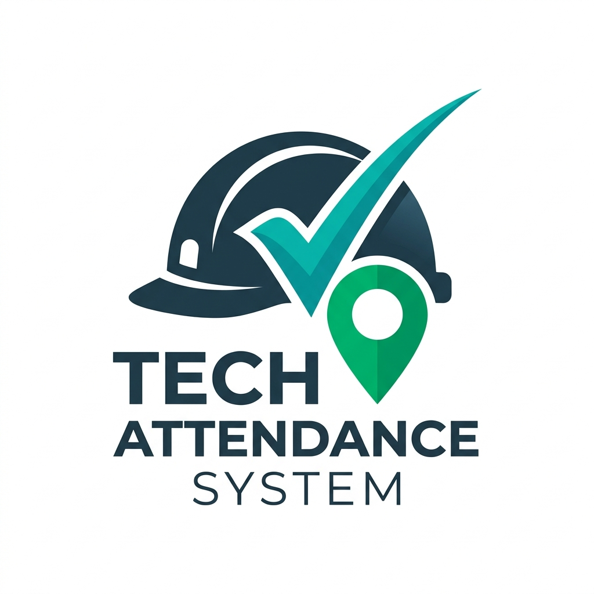

# 📋 Absensi & Dokumentasi Teknisi (Tech Attendance System)

<p align="center">
  
</p>

[](#)
[](#)
[](#)
[](#)
[](#)

Sistem Informasi Absensi, Penugasan Lapangan, dan Verifikasi Dokumentasi Checklist bagi Teknisi Lapangan secara real-time. Aplikasi ini dirancang menggunakan arsitektur modern (React 19 + Vite 8) dengan fokus khusus pada **aksesibilitas pengguna** (teknisi senior/berumur) serta verifikasi hasil kerja yang ketat oleh Administrator.

---

## ✨ Fitur Utama

### 👨‍🔧 Panel Teknisi (Technician Dashboard)
* **Double-Layer Absensi**: Membedakan absensi harian umum (*Check In Masuk* / *Check Out Pulang*) dengan absensi kunjungan kerja (*Check In Visit* / *Check Out Visit*).
* **Penugasan Mandiri**: Daftar pekerjaan hari ini berdasarkan lokasi, Site ID, dan tipe maintenance yang ditugaskan admin.
* **Klasifikasi Pekerjaan**:
  * **CORRECTIVE MAINTENANCE (CM)**: Memerlukan minimal **5 foto/dokumen** bebas diupload untuk dapat disubmit.
  * **PREVENTIVE MAINTENANCE (PM)**: Memerlukan total **51 foto/dokumen** wajib yang disesuaikan secara terstruktur berdasarkan item checklist wajib.
* **Drafting Progress**: Teknisi dapat menyimpan progres dokumen (*Save Draft*) kapan saja tanpa harus menunggu kuota minimal upload terpenuhi.
* **Review Dokumentasi Aksesibel (Older Technician Friendly)**:
  * Modal peninjau foto berukuran ekstra besar.
  * Dilengkapi tombol **Zoom Font (A- / A+)** ala Google (skala 80% s.d. 200%) untuk memudahkan pembacaan oleh teknisi senior.
* **Request Pengecekan**: Mengirimkan sinyal langsung ke Admin agar pekerjaan yang baru diselesaikan dapat segera ditinjau.

### 👑 Panel Admin (Administrator Dashboard)
* **Manajemen Lokasi & Import**: Unggah data lokasi secara massal menggunakan file `.xlsx`, `.csv`, atau `.docx`.
* **Pembuat Penugasan (Assignment)**: Membuat penugasan baru dengan pilihan tipe CM atau PM beserta tanggal kunjungan.
* **Pusat Penilaian Dokumentasi (Review Center)**:
  * Meninjau hasil foto/dokumen yang diupload teknisi.
  * Menolak/menyetujui dokumen dengan catatan perbaikan (*Review Note*).
  * Menolak (*Tolak*) atau menyetujui (*Setujui*) penugasan secara keseluruhan dari status **Menunggu Pemeriksaan** ke **Selesai** atau mengembalikannya ke **Dikerjakan**.
  * **Dropdown Perubahan Status**: Mengubah status penugasan secara instan (*Menunggu*, *Dikerjakan*, *Menunggu Pemeriksaan*, *Selesai*, *Dibatalkan*) secara langsung dari tabel utama menggunakan dropdown interaktif berkode warna.
* **Pemberitahuan Instan (Notifications)**: Lonceng notifikasi yang terupdate secara real-time. Mengklik notifikasi pemeriksaan akan langsung mengarahkan Admin ke tabel tinjauan dokumen bersangkutan serta menggulir halaman secara otomatis.

---

## 🛠️ Tech Stack & Arsitektur

* **Frontend (Client)**:
  * **React 19** (Context API, Hooks)
  * **Vite 8** (Penyusunan modul super cepat)
  * **Tailwind CSS** (Tema responsif, mode Gelap/Terang)
  * **Lucide / SVG Icons** (Visual yang tajam)
* **Backend (Server)**:
  * **Node.js** & **Express**
  * **SQLite** (`better-sqlite3` untuk performa query lokal yang cepat)
  * **Multer** (Pengolahan unggahan file)
  * **Mammoth & XLSX** (Parsing file dokumen saat import data lokasi)

---

## 🚀 Panduan Instalasi & Menjalankan Aplikasi

### Persyaratan Sistem
* Node.js versi 18 ke atas
* NPM atau Yarn

### Langkah 1: Kloning & Pemasangan Dependensi
```bash
# Clone repository
git clone https://github.com/username/absensi-teknisi.git
cd absensi-teknisi

# Install dependensi root & server
npm install

# Install dependensi frontend client
cd client
npm install
cd ..
```

### Langkah 2: Konfigurasi Database
Database SQLite akan terbuat secara otomatis (`server/absensi.db`) pada saat pertama kali server dijalankan, beserta skema tabel dan migrasi kolom yang diperlukan.

### Langkah 3: Menjalankan Server secara Concurrently (Dev Mode)
Kembali ke direktori utama (*root*) project, lalu jalankan perintah:
```bash
npm run dev
```
Perintah ini akan menyalakan server backend di port `3001` dan client Vite di port `5173` secara bersamaan:
* Frontend Client: [http://localhost:5173/](http://localhost:5173/)
* Backend Server API: [http://localhost:3001/](http://localhost:3001/)

---

## 🔒 Akun Demo Pengujian

Anda dapat masuk menggunakan akun demo berikut:

| Peran (Role) | Email | Password |
| :--- | :--- | :--- |
| **Administrator** | `admin@gmail.com` | `admin123` |
| **Teknisi (Asep)** | `teknisi@gmail.com` | `teknisi123` |

---

## 👥 Kontributor
* Developer & AI Assistant (Antigravity Team)
